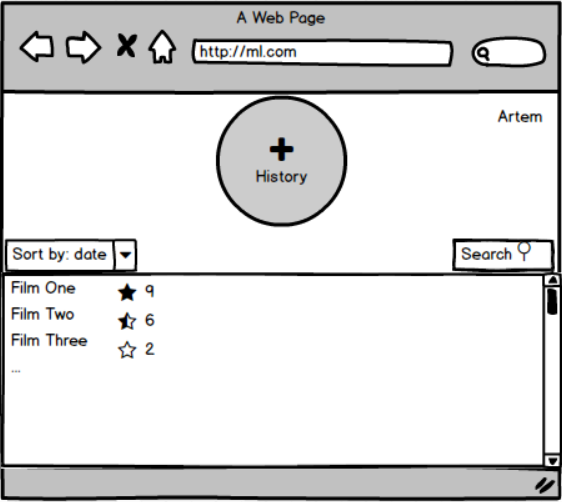
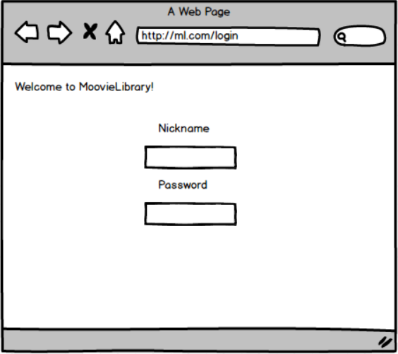

# Требования к проекту
### Содержание
1. [Введение](#1)  
  1.1. [Назначение](#1.1)  
  1.2. [Бизнес-требования](#1.2)  
      1.2.1. [Границы проекта](#1.2.1)  
  1.3. [Аналоги](#1.3)  
2. [Требования пользователя](#2)  
  2.1. [Программные интерфейсы](#2.1)  
  2.2. [Интерфейс пользователя](#2.2)  
  2.3. [Характеристики пользователей](#2.3)  
3. [Системные требования](#3)  
  3.1. [Функциональные требования](#3.1)  
  3.2. [Нефункциональные требования](#3.2)  
     3.2.1. [Атрибуты качества](#3.2.1)  
     3.2.2. [Внешний интерфейс](#3.2.2)  
     3.2.3. [Ограничения](#3.2.3)  

### 1. Введение 
#### 1.1 Назначение 
У киноманов зачастую бывает проблема - найти то, что еще не смотрел и отследить то, что уже просмотрено. MooveiLibraby поможет с этим вопросом.
#### 1.2 Бизнес-требования 
##### 1.2.1. Границы проекта 
Веб-интерфейс позволяет список просмотренных фильмов, ставить собственные оценки и предоставляет список доступных к просмотру новых фильмов.
#### 1.3 Аналоги 
Данный проект очень схож с онлайн-кинотеартом IVI ["IVI.ru"](https://www.ivi.ru). Основные отличия MoovieLibrary - безвозмездная основа и отсутствие возможности просмотра прямо на сайте.
### 2. Требования пользователя 
#### 2.1. Программные интерфейсы 
//Проект использует простой веб-фреймворк Bottle. Взаимодействует с программой Asterisk через обработку конфигурационных файлов. Asterisk в новых версиях предоставляет RESTful API, но ручная обработка конфигурационных файлов необходима для обеспечения совместимости со старыми версиями.
#### 2.2. Интерфейс пользователя 
/*Графический интерфейс проекта представлен с помощью мокапа:

*/
#### 2.3. Характеристики пользователей 
Целевой аудиторией являются киноманы и пользователи, заинтересованные в систематизации просмотренных фильмов.
### 3. Системные требования 
Необходимо постоянное подключение к интернету.
#### 3.1. Функциональные требования 
Пользователю предоставлены возможности, представленные в таблице.

Функция | Требования
--- | ---
Авторизация | Сайт должен предоставить пользователю возможность войти в свой профиль и сохранять свои данные
История просмотра | Сайт должен предоставить пользователю информацию о просмотренных фильмах
Буду смотреть | Сайт должен предоставить пользователю информацию о запланированных к просмотру фильмах
Оценки  | Сайт должен предоставить пользователю возможность просматривать оценки к фильмам от кинокритиков, а так же выставлять свои собственные оценки
Сортировка | Сайт должен предоставить пользователю возможность отсортировать фильмы по алфавиту, дате добавления, оценкам
Поиск | Сайт должен предоставить пользователю возможность поиска фильмов

#### 3.2. Нефункциональные требования 

  ##### 3.2.1. Атрибуты качества 
Важным атрибутом качества данного сайта является понятный интерфейс, а именно - его легкость использования неопытными пользователями.
  ##### 3.2.2 Внешний интерфейс 
Приложение удобно для использования пользователями с плохим зрением:
  * размер шрифта не менее 14пт;
  * функциональные элементы контрастны фону.
  ##### 3.2.3 Ограничения 
Необходимо постоянное подключение к интернету.